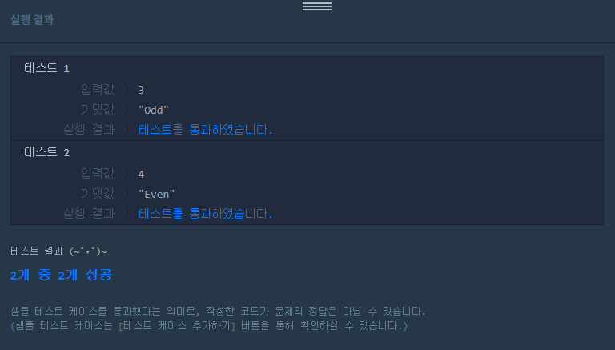

#### 2020-01-31

# 평균 구하기

## 1. 문제

##### 문제 설명

정수 num이 짝수일 경우 Even을 반환하고 홀수인 경우 Odd를 반환하는 함수, solution을 완성해주세요.

##### 제한 조건

- num은 int 범위의 정수입니다.
- 0은 짝수입니다.

##### 입출력 예

| num  | return |
| ---- | :----: |
| 3    | "Odd"  |
| 4    | "Even" |

## 2. 문제 풀이

```python
def solution(num):
    return num % 2 and "Odd" or "Even"
```




